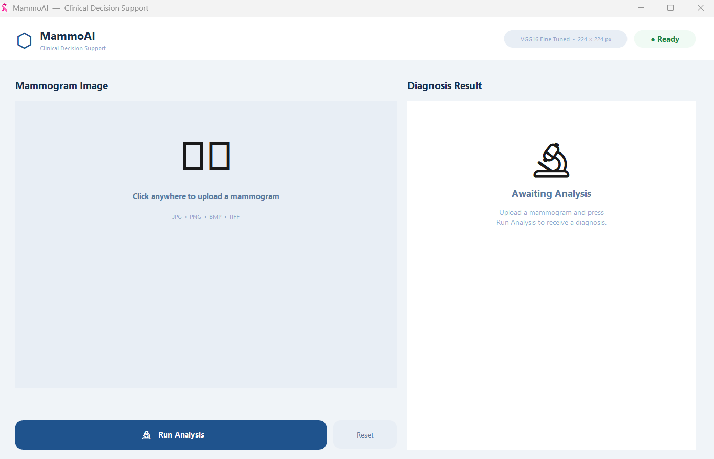

<h1 align="center">🎀 MammoAI: Early Breast Cancer Detection System 🎀</h1>

  <strong>Department of Software Engineering | College of Information Technology</strong> 
  <strong>Amman Arab University (AAU) - 2024/2025</strong>

---

## 👩‍💻 The Development Team
*   **Yasmin MhdFadi Hababa**
*   **Nermeen Mohammad Almomani**
*   **Rama Haitham Abumenshar** 

**Under the Supervision of:**
*   **Dr. Omar Al-Akash** (Supervisor)
*   **Dr. Mejhem Altarawneh** (Co-Supervisor)

---

## 🌟 Project Overview
**MammoAI** is an advanced medical diagnostic support application developed as a B.Sc. graduation project. It utilizes a **Fine-Tuned VGG16 Convolutional Neural Network (CNN)** to assist radiologists in identifying breast cancer from mammogram images with industry-leading accuracy.

Our system bridges the gap between complex Deep Learning models and clinical usability by providing a seamless, standalone desktop interface for medical professionals.

## 🛠️ Technical Stack
The **MammoAI** system is built using industry-standard technologies to ensure stability and high performance:

| Technology | Badge | Purpose |
| :--- | :--- | :--- |
| **Python** |  | Core Programming Language |
| **TensorFlow** |  | Deep Learning Framework |
| **CNN Architecture** |  | Transfer Learning Model |
| **GUI Framework** |  | Modern Desktop Interface |

## 👩‍💻 The Development Team
*   **Yasmin MhdFadi Hababa** (ID: 202110369)
*   **Nermeen Mohammad Almomani** (ID: 202110393)
*   **Rama Haitham Abumenshar** (ID: 202120342)

**Under the Supervision of:**
*   **Dr. Omar Al-Akash** (Supervisor)
*   **Dr. Mejhem Altarawneh** (Co-Supervisor)

## 📊 Performance Benchmark
The model underwent rigorous optimization to overcome common AI challenges in medical imaging.

| Metric | Baseline Model | **Optimized MammoAI** |
| :--- | :---: | :---: |
| **Accuracy** | 94.59% | **98.18%** |
| **Precision** | 91.20% | **98.19%** |
| **Recall** | 88.40% | **98.18%** |
| **F1-Score** | 0.90 | **0.98** |

## 🏗️ System Architecture & Workflow
The application follows a structured four-stage process:
1.  **Ingestion:** Medical Professional uploads a mammogram image.
2.  **Preprocessing:** Automated resizing and feature normalization via OpenCV/TensorFlow.
3.  **Analysis:** CNN Feature Extraction & Softmax Classification.
4.  **Reporting:** Visual UI output displaying status (Benign/Malignant) and Confidence levels.

## 📦 Installation & Deployment
1.  Navigate to the **[Releases](../../releases)** section.
2.  Download the `MammoAI_Setup.exe` installer.
3.  Run the installer on any Windows 10/11 machine.
4.  Launch **MammoAI** from the desktop shortcut and start analyzing.

### 📸 Interface Preview

  

## 🔮 Future Roadmap
*   **Explainable AI (XAI):** Implementing **Grad-CAM** heatmaps to highlight tumor locations.
*   **Multi-Modal Support:** Expanding training to include Ultrasound and MRI scans.
*   **Web Integration:** Transitioning to a secure Cloud-based SaaS platform for hospital networks.

---
### 📜 License
This software
